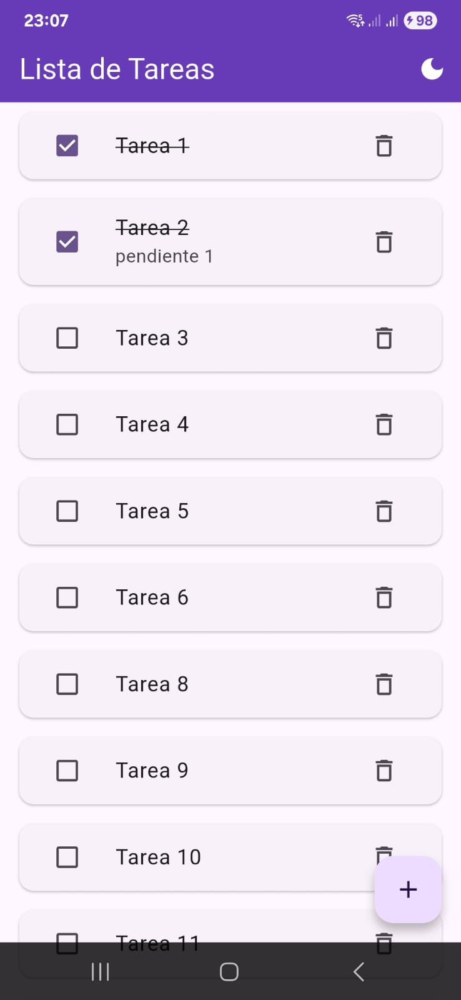
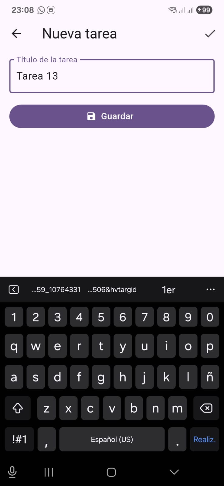
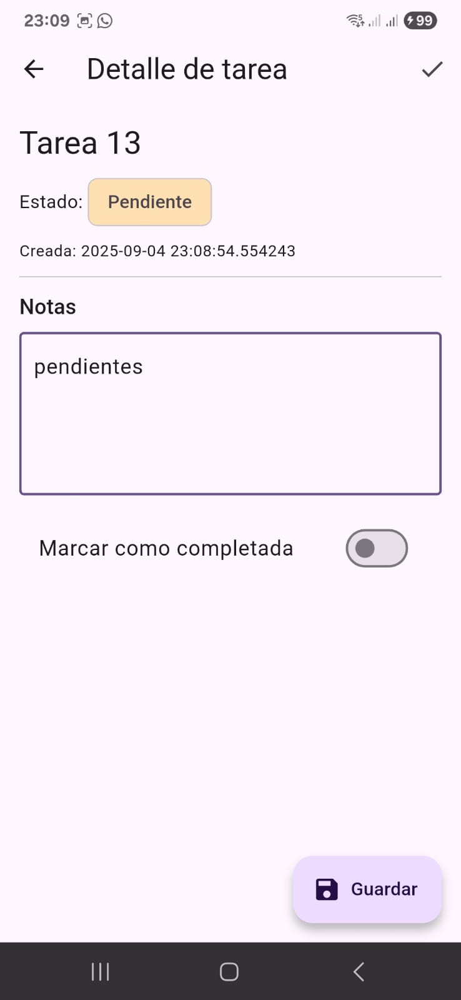
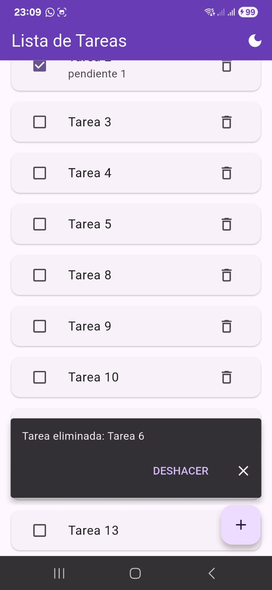
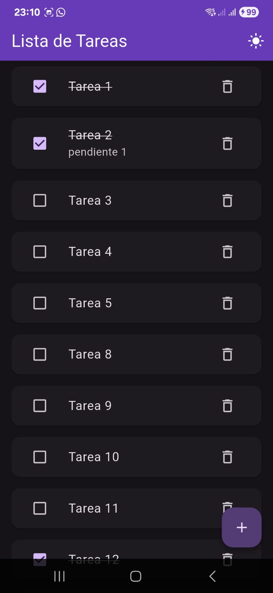

# To-Do App (Flutter)

Aplicación de lista de tareas con **estado global (Provider)**, **persistencia local (SharedPreferences)** y **UX con AnimatedList + SnackBar**.  
Entrega final – Semana 8.

## 🧰 Tecnologías
Flutter (Material 3) · Provider · SharedPreferences · AnimatedList/SnackBar · Botón de tema claro/oscuro

## ✨ Funcionalidades
- Agregar tareas (validación de título).
- Marcar como completadas (checkbox, texto tachado).
- Detalle con **notas** y guardar cambios.
- Eliminar + **DESHACER**.
- Persistencia al cerrar/abrir la app.
- Alternar **tema claro/oscuro** desde el AppBar.

## ▶️ Ejecución
```bash
flutter pub get
flutter run -d <ID_DISPOSITIVO>

📦 APK (entrega)

todo_app/build/app/outputs/apk/debug/app-debug.apk
(Generado con flutter build apk --debug)

## 🖼️ Capturas

<table>
  <tr>
    <td align="center">Home</td>
    <td align="center">Agregar</td>
    <td align="center">Detalle</td>
  </tr>
  <tr>
    <td></td>
    <td></td>
    <td></td>
  </tr>
  <tr>
    <td align="center">SnackBar + Undo</td>
    <td align="center">Tema oscuro</td>
    <td></td>
  </tr>
  <tr>
    <td></td>
    <td></td>
    <td></td>
  </tr>
</table>
